# Estructura de la base de datos del anuario: ¿definida? ¿Cómo se cruzan? Mapa entidad-relación

---

## 1. ¿Tenemos definida la estructura de la base de datos?

**A nivel lógico: sí.** Están definidos:

- Las **23 tablas temáticas** (nombres y agrupación de cuadros).
- Las **columnas sugeridas** por tabla (anio, cuadro_id, origen_archivo, concepto, monto, nombre_empresa, datos JSONB, etc.).
- El **mapeo** de los 100 CSV a cada tabla.

**A nivel físico: no del todo.** Todavía no está:

- El **DDL** con tipos de dato, longitudes y nulabilidad.
- Las **claves primarias** (PK) de cada tabla.
- Las **claves foráneas** (FK) que relacionen tablas entre sí.
- Los **índices** para consultas por anio, cuadro_id, nombre_empresa.

Por tanto: la estructura está **definida en diseño**, pero **no implementada** en script SQL (CREATE TABLE con PK/FK). Las 23 tablas son el “qué” y “cómo se agrupan”; el “cómo se relacionan” y el “cómo se implementa” se explicitan en las secciones siguientes.

---

## 2. ¿Cómo se cruzan estas tablas?

Hoy las tablas **no tienen claves foráneas declaradas**; se cruzan por **campos comunes** que permiten hacer JOINs o filtrar de forma coherente.

### 2.1 Campos que actúan como “llaves de cruce”

| Campo | Dónde aparece | Uso para cruce |
|-------|----------------|----------------|
| **anio** | Todas las tablas | Filtrar o unir por año (ej. solo 2023, o comparar 2023 vs 2024). |
| **cuadro_id** | Todas las tablas | Saber de qué cuadro del anuario viene la fila; agrupar por tipo de reporte; opcionalmente FK a catálogo de cuadros. |
| **nombre_empresa** | Tablas “por empresa” (primas_por_ramo_empresa, reservas_*_por_empresa, datos_por_empresa, indicadores_financieros_empresa, listados_empresas, balance_por_empresa_reaseguros, ingresos_egresos_por_empresa_reaseguros, suficiencia_patrimonio) | Cruzar la misma empresa entre cuadros/sectores (ej. indicadores C29 + C44 si la empresa aparece en ambos). Mismo nombre = misma entidad (con riesgo de variaciones de texto). |
| **concepto** | balances_condensados, estados_ingresos_egresos, reservas_tecnicas_agregado, gestion_general, inversiones_reservas_tecnicas, balance_por_empresa_reaseguros | Comparar la misma línea contable entre sectores (ej. “RESERVAS TÉCNICAS” en C24 vs C54) o entre años. |
| **concepto_ramo** / **concepto_ramo_o_empresa** | primas_por_ramo, siniestros_por_ramo, reservas_*_por_ramo, gastos_vs_primas, cantidad_polizas_siniestros | Cruzar por ramo (ej. “Hospitalización Colectivo” en primas y en siniestros). |

### 2.2 Cruces típicos (sin FKs, por columnas)

- **Misma empresa, varios cuadros:**  
  `indicadores_financieros_empresa` (cuadro_id 29, 44, 52, 58) → JOIN por `anio` y `nombre_empresa` para comparar indicadores de una empresa entre sectores (seguro directo, reaseguro, financiadoras, medicina prepagada).

- **Mismo concepto, varios sectores:**  
  `balances_condensados` (cuadro_id 24, 40, 47, 54) → filtrar por `concepto` (ej. “RESERVAS TÉCNICAS”) y comparar `monto` por `cuadro_id`/sector.

- **Mismo año y ramo en primas y siniestros:**  
  `primas_por_ramo` y `siniestros_por_ramo` → JOIN por `anio`, `cuadro_id` (o origen) y `concepto_ramo` para ratios primas/siniestros por ramo.

- **Listados vs datos por empresa:**  
  `listados_empresas` (39, 46, 53) da el universo de empresas por sector; el resto de tablas “por empresa” se pueden filtrar o cruzar por `nombre_empresa` y `anio`.

Hasta que no existan tablas de dimensiones (cuadro, empresa, ramo) con PK y FKs desde las tablas temáticas, estos cruces son **lógicos** (mismas columnas), no **declarados** en el esquema.

---

## 3. Mapa entidad-relación

### 3.1 Entidades (dimensiones) y hechos

Se distinguen:

- **Dimensiones (catálogos):** identificadores estables que varias tablas pueden compartir.
- **Hechos (tablas temáticas):** las 23 tablas que cargan desde los CSV; referencian las dimensiones por valor (anio, cuadro_id, nombre_empresa, etc.).

Propuesta de dimensiones:

| Entidad | Descripción | PK sugerida | Uso |
|---------|-------------|-------------|-----|
| **cuadros** | Catálogo de cuadros del anuario (3, 4, 5-A, …, 58). | cuadro_id (TEXT o INT) | Todas las tablas temáticas llevan cuadro_id → FK a cuadros. Permite describir nombre, sector, página. |
| **sectores** | Tipo de sujeto regulado: seguro_directo, reaseguro, financiadoras_primas, medicina_prepagada. | sector_id | Opcional: derivable de cuadro_id; útil para filtrar/agrupar. |
| **empresas** (opcional) | Empresas únicas por nombre (o normalizado). | empresa_id (UUID o SERIAL) | Si se normaliza: reemplazar nombre_empresa por empresa_id en tablas “por empresa” y tener una sola fuente de verdad de nombres. |
| **ramos** (opcional) | Ramos de seguro (Vida Individual, Hospitalización Colectivo, etc.). | ramo_id | Si se unifican los “concepto_ramo” de varios CSV en un catálogo; opcional en una primera fase. |

Las **23 tablas temáticas** son tablas de **hechos** (o staging): cada fila = una fila de dato del anuario para un anio y un cuadro_id, y opcionalmente nombre_empresa o concepto_ramo.

### 3.2 Relaciones entre dimensiones y tablas temáticas

- **anio:** no es una tabla; es un atributo en todas las tablas. Cruce por año.
- **cuadro_id** (en las 23 tablas) → **cuadros.cuadro_id**. Relación N:1 (muchas filas de hecho por un cuadro).
- **nombre_empresa** (en tablas “por empresa”) → si existe **empresas**, se puede tener **empresas.nombre_normalizado** y relacionar por nombre o por empresa_id (FK).
- **concepto** / **concepto_ramo:** por ahora son texto; si más adelante se crea **conceptos** o **ramos**, se podría pasar a FK.

No hay relaciones **entre las 23 tablas temáticas entre sí** (no hay FK de una tabla temática a otra). El cruce es por **valores compartidos** (anio, cuadro_id, nombre_empresa, concepto).

### 3.3 Diagrama entidad-relación (Mermaid)

```mermaid
erDiagram
    CUADROS ||--o{ primas_por_ramo : "cuadro_id"
    CUADROS ||--o{ primas_por_ramo_empresa : "cuadro_id"
    CUADROS ||--o{ siniestros_por_ramo : "cuadro_id"
    CUADROS ||--o{ reservas_tecnicas_agregado : "cuadro_id"
    CUADROS ||--o{ reservas_prima_por_ramo : "cuadro_id"
    CUADROS ||--o{ reservas_prima_por_empresa : "cuadro_id"
    CUADROS ||--o{ reservas_prestaciones_por_ramo : "cuadro_id"
    CUADROS ||--o{ reservas_prestaciones_por_empresa : "cuadro_id"
    CUADROS ||--o{ reservas_detalle_por_ramo_empresa : "cuadro_id"
    CUADROS ||--o{ inversiones_reservas_tecnicas : "cuadro_id"
    CUADROS ||--o{ gastos_vs_primas : "cuadro_id"
    CUADROS ||--o{ balances_condensados : "cuadro_id"
    CUADROS ||--o{ estados_ingresos_egresos : "cuadro_id"
    CUADROS ||--o{ gestion_general : "cuadro_id"
    CUADROS ||--o{ datos_por_empresa : "cuadro_id"
    CUADROS ||--o{ indicadores_financieros_empresa : "cuadro_id"
    CUADROS ||--o{ suficiencia_patrimonio : "cuadro_id"
    CUADROS ||--o{ series_historicas_primas : "cuadro_id"
    CUADROS ||--o{ reservas_hospitalizacion : "cuadro_id"
    CUADROS ||--o{ cantidad_polizas_siniestros : "cuadro_id"
    CUADROS ||--o{ listados_empresas : "cuadro_id"
    CUADROS ||--o{ balance_por_empresa_reaseguros : "cuadro_id"
    CUADROS ||--o{ ingresos_egresos_por_empresa_reaseguros : "cuadro_id"

    CUADROS {
        string cuadro_id PK
        string nombre
        string sector "opcional"
    }

    EMPRESAS {
        uuid empresa_id PK "opcional"
        string nombre_empresa
        string sector "opcional"
    }

    EMPRESAS ||--o{ primas_por_ramo_empresa : "nombre_empresa"
    EMPRESAS ||--o{ reservas_prima_por_empresa : "nombre_empresa"
    EMPRESAS ||--o{ reservas_prestaciones_por_empresa : "nombre_empresa"
    EMPRESAS ||--o{ datos_por_empresa : "nombre_empresa"
    EMPRESAS ||--o{ indicadores_financieros_empresa : "nombre_empresa"
    EMPRESAS ||--o{ suficiencia_patrimonio : "nombre_empresa"
    EMPRESAS ||--o{ listados_empresas : "nombre_empresa"
    EMPRESAS ||--o{ balance_por_empresa_reaseguros : "nombre_empresa"
    EMPRESAS ||--o{ ingresos_egresos_por_empresa_reaseguros : "nombre_empresa"
```

Nota: en el diagrama, “CUADROS” y “EMPRESAS” son las dimensiones; las 23 tablas son las que tienen muchas filas por cuadro (y por empresa donde aplica). La relación es “un cuadro tiene muchas filas en cada tabla temática” y “una empresa tiene muchas filas en las tablas por empresa”. Hoy esas relaciones no están implementadas como FK; el diagrama muestra el **modelo objetivo**.

---

## 4. Resumen

| Pregunta | Respuesta |
|----------|-----------|
| **¿Tenemos definida la estructura?** | Sí a nivel **lógico** (23 tablas, columnas sugeridas, mapeo CSV). No a nivel **físico** (DDL con PK/FK/índices). |
| **¿Cómo se cruzan las tablas?** | Por **anio**, **cuadro_id**, **nombre_empresa** y **concepto** / **concepto_ramo**, sin FKs declaradas. Los cruces son JOINs o filtros sobre esas columnas. |
| **¿Está identificado el mapa entidad-relación?** | Sí: **dimensiones** (cuadros, opcional empresas, opcional ramos/sectores) y **23 tablas de hechos** que las referencian por valor; diagrama ER en sección 3.3. |

**Siguiente paso recomendado:** escribir el DDL del schema `anuario`: (1) tablas de dimensiones (**cuadros**, y si se desea **empresas**), (2) las 23 tablas temáticas con PK (p. ej. anio + cuadro_id + fila_orden o id serial) y FK a **cuadros**, (3) índices en anio, cuadro_id, nombre_empresa. Así la estructura queda definida también a nivel físico y el mapa entidad-relación queda implementado en la base.
